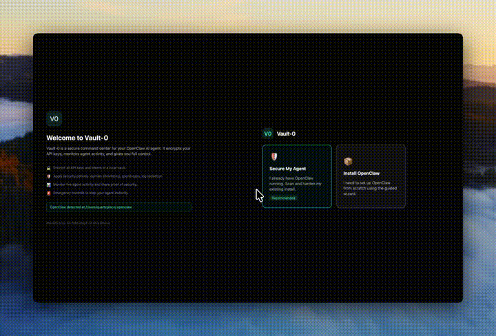

# Vault-0 — Agent Security, Monitor & x402 Wallet for OpenClaw

<p align="center">
  <strong>Encrypted secret vault, real-time agent monitor, and x402 wallet for OpenClaw agents.</strong>
</p>

<p align="center">
  <a href="#install">Install</a> · <a href="#quick-start">Quick Start</a> · <a href="#how-it-works">How It Works</a> · <a href="#features">Features</a> · <a href="#architecture">Architecture</a> · <a href="#contributing">Contributing</a>
</p>

<p align="center">
  <a href="LICENSE"></a>
  <a href="https://github.com/0-Vault/Vault-0/releases"></a>
  <a href="https://youtu.be/FGGWJdeyY9g"></a>
</p>

<p align="center"></p>

---

**Vault-0** is a desktop app that secures your [OpenClaw](https://github.com/openclaw/openclaw) AI agent. It encrypts your API keys, monitors agent activity, enforces security policies, and gives you full control — all from one place.

Your agent keeps working exactly as before. Vault-0 wraps it in a security layer without changing how OpenClaw operates.

**The problem:** OpenClaw stores API keys as plaintext in `~/.openclaw/.env`. Anyone with disk access can read them. A prompt injection can exfiltrate them. There's no spend limit, no domain allowlist, no kill switch.

**The fix:** Vault-0 moves your secrets into an encrypted vault (AES-256-GCM + Argon2id), injects them ephemerally at launch (~2 seconds on disk, then zeroed), and applies security policies automatically.

## Quick Start

**Via ClawHub** (let your agent install it):

```bash
clawhub install vault0
```

Or paste this link to your OpenClaw agent:

```
https://raw.githubusercontent.com/0-Vault/Vault-0/main/skills/vault0/SKILL.md
```

**For existing OpenClaw users** (manual):

1. Download Vault-0 from [Releases](https://github.com/0-Vault/Vault-0/releases)
2. Open it — Vault-0 auto-detects your OpenClaw install
3. Choose **"Secure My Agent"**, **"Just Monitor"**, or **"Install OpenClaw"**
4. For security hardening: set a master passphrase and click **"Harden Now"**

**For monitoring only:**

1. Download Vault-0
2. Click **"Just Monitor"** on the welcome screen
3. Click **"Connect"** on the Monitor page — streams live agent activity

## How It Works

```
BEFORE:                              AFTER:
~/.openclaw/.env                     ~/.openclaw/.env
┌──────────────────────┐             ┌──────────────────────────┐
│ OPENAI_API_KEY=sk-.. │             │ # Managed by Vault-0     │
│ ANTHROPIC_KEY=sk-..  │             │ # Secrets injected at    │
│ TELEGRAM_TOKEN=123.. │             │ # runtime from vault     │
└──────────────────────┘             └──────────────────────────┘
    PLAINTEXT ON DISK                    ZERO SECRETS ON DISK

                                     ~/Library/.../Vault0/vault.enc
                                     ┌──────────────────────────┐
                                     │ AES-256-GCM encrypted    │
                                     │ Argon2id key derivation  │
                                     │ Master passphrase locked │
                                     └──────────────────────────┘
```

**Ephemeral injection:** When you click "Start Secure Agent", Vault-0:
1. Decrypts your keys from the vault
2. Writes them to `.env` for ~2 seconds
3. Restarts the OpenClaw daemon (keys load into memory)
4. Deletes `.env` immediately
5. Agent runs with real keys in memory — nothing on disk

## Features

### Encrypted Secret Vault
- AES-256-GCM encryption with Argon2id key derivation
- Master passphrase protected
- Vercel-style secrets manager UI (show/hide, add, edit, delete)
- Auto-detects new plaintext keys added by OpenClaw and prompts migration

### One-Click Hardening
- Scans OpenClaw config for plaintext API keys
- Creates encrypted backup before any changes
- Migrates secrets to vault + cleans config files
- Applies security policy + starts proxy
- Restarts agent with vault keys — all in one click

### Security Policy Engine (Proxy — Opt-In)
- Local proxy available at `127.0.0.1:3840` for policy enforcement
- Domain allowlisting (only approved API endpoints)
- Metadata endpoint blocking (169.254.169.254)
- Spend cap on x402 payments
- Log redaction patterns (strip API keys from output)
- To route agent traffic through the proxy, set `HTTP_PROXY=http://127.0.0.1:3840` in your agent environment

### Live Dashboard
- Real-time gateway health monitoring
- Proxy activity feed (requests proxied, blocked, payments)
- Before/after security comparison
- Emergency stop + revert controls
- Share proof of secure setup

### Optional Agent Wallet
- Self-custodial EVM wallet (BIP-39 + macOS Keychain)
- x402 micropayment support (USDC on Base)
- EIP-3009 TransferWithAuthorization signing

### Integrated Terminal
- VSCode-style bottom terminal panel
- Run `openclaw tui` to chat with your agent
- Run `openclaw status`, `openclaw doctor` for diagnostics
- Persists across page navigation

## Install

### From Release (recommended)

Download the latest `.dmg` from [GitHub Releases](https://github.com/0-Vault/Vault-0/releases).

macOS only. Requires OpenClaw installed separately (`npm install -g openclaw@latest`).

### From Source

```bash
git clone https://github.com/0-Vault/Vault-0.git
cd Vault-0

npm install
cargo install tauri-cli
npm run tauri dev    # development
npm run tauri build  # production .dmg
```

**Requirements:**
- Node.js >= 22
- Rust (stable)
- macOS 10.15+

## Architecture

```
┌─────────────────────────────────────────────────┐
│                    Vault-0                       │
│                                                  │
│  ┌──────────┐  ┌──────────┐  ┌───────────────┐  │
│  │  Vault   │  │  Policy  │  │    Proxy      │  │
│  │  Store   │  │  Engine  │  │  (Axum HTTP)  │  │
│  │ AES-256  │  │ Allow/   │  │  127.0.0.1:   │  │
│  │ Argon2id │  │ Block    │  │  3840         │  │
│  └────┬─────┘  └────┬─────┘  └───────┬───────┘  │
│       │              │                │          │
│  ┌────┴──────────────┴────────────────┴───────┐  │
│  │              Tauri Backend (Rust)           │  │
│  └────────────────────┬───────────────────────┘  │
│                       │                          │
│  ┌────────────────────┴───────────────────────┐  │
│  │           Svelte Frontend                   │  │
│  │  Dashboard · Secrets · Policies · Terminal  │  │
│  └────────────────────────────────────────────┘  │
└─────────────────────────────────────────────────┘
                        │
                        ▼
┌─────────────────────────────────────────────────┐
│              OpenClaw Gateway                    │
│              ws://127.0.0.1:18789               │
│  Agent · Sessions · Channels · Tools · Skills   │
└─────────────────────────────────────────────────┘
```

### Tech Stack

| Layer | Technology |
|-------|-----------|
| Desktop framework | Tauri v2 |
| Backend | Rust (Axum, Tokio, AES-GCM, Argon2) |
| Frontend | Svelte 4 + Tailwind CSS |
| Terminal | xterm.js + tauri-plugin-pty |
| Encryption | AES-256-GCM + Argon2id KDF |
| Wallet | alloy-signer-local (BIP-39, EIP-3009) |
| Key storage | macOS Keychain (wallet mnemonic) |

### Rust Modules

| Module | Purpose |
|--------|---------|
| `vault_store` | Encrypted secret vault (create, unlock, CRUD entries) |
| `detect` | OpenClaw detection, hardening, ephemeral .env writer |
| `proxy` | HTTP reverse proxy with policy enforcement (opt-in, not in default traffic path) |
| `policy` | Domain allowlist, spend caps, redaction patterns |
| `evidence` | Tamper-evident event log with SHA-256 receipts |
| `openclaw_health` | Gateway health checks + config parsing |
| `wallet` | EVM wallet creation, import, signing |
| `x402` | x402 payment parsing and settlement |
| `mcp_guard` | MCP request validation + SSRF protection |

## Security Model

1. **Secrets never persist on disk** — stored encrypted in vault, injected ephemerally at runtime
2. **Master passphrase never leaves your machine** — Argon2id derives the encryption key locally
3. **Policy enforcement** — opt-in proxy with domain allowlisting to prevent exfiltration to unauthorized endpoints
4. **Tamper-evident logging** — every proxy event is logged with SHA-256 hashes
5. **Emergency controls** — one-click proxy kill switch + full revert to pre-hardening state
6. **No telemetry, no cloud** — everything runs locally on your Mac

## Roadmap

- [ ] Spend tracking with real-time cost display
- [ ] Prompt injection blocking (common jailbreak phrase detection)
- [ ] Approval queue for risky actions (channel sends, payments)
- [ ] Auto-rotation of API keys
- [ ] Touch ID / biometric vault unlock
- [ ] Linux support
- [ ] Windows support (WSL2)

## Contributing

PRs welcome. See [CONTRIBUTING.md](CONTRIBUTING.md) for guidelines.

```bash
# Development
npm run tauri dev

# Build
npm run tauri build

# Rust tests
cd src-tauri && cargo test

# Frontend build
npm run build
```

## License

[MIT](LICENSE)

---

Built for the [OpenClaw](https://github.com/openclaw/openclaw) community. Secure your agent. Ship with confidence.
